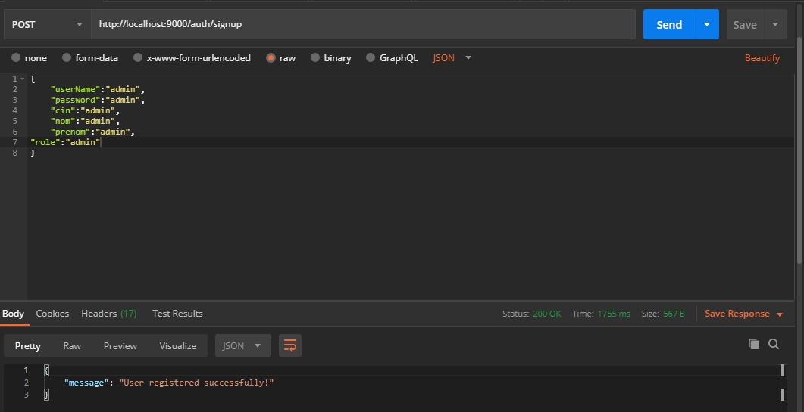
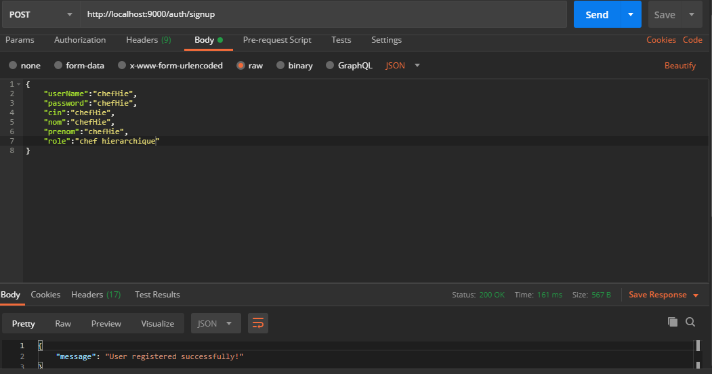
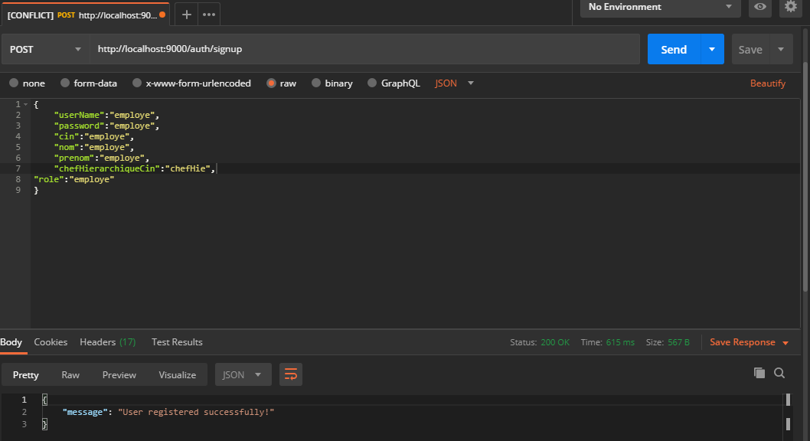
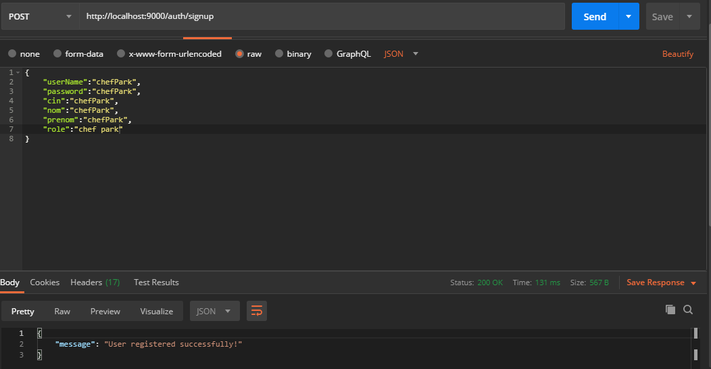
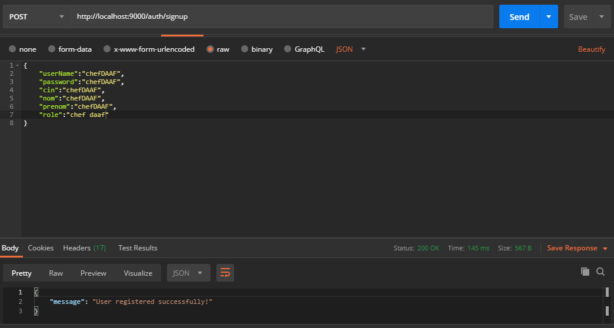
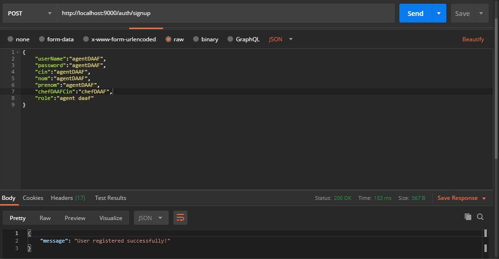

# back
# first think to do after running the prg 
# open H2 console et run this sql request

insert into roles(name) values('ROLE_EMPLOYE');

insert into roles(name) values('ROLE_CHEFPARK');

insert into roles(name) values('ROLE_CHEFHIERARCHIQUE');

insert into roles(name) values('ROLE_AGENTDAAF');

insert into roles(name) values('ROLE_CHEFDAAF');

insert into roles(name) values('ROLE_ADMIN');

# after go to 
http://localhost:9000/auth/signup
# To add an admin user you need to put this body in your request

# To add a "chef hierarchique user" you need to put this body in your request

# To add a "employe user" you need to put this body in your request

# To add a "chef park user" you need to put this body in your request

# To add an "chef DAAF user" you need to put this body in your request

# To add an "agent DAAF user" you need to put this body in your request

